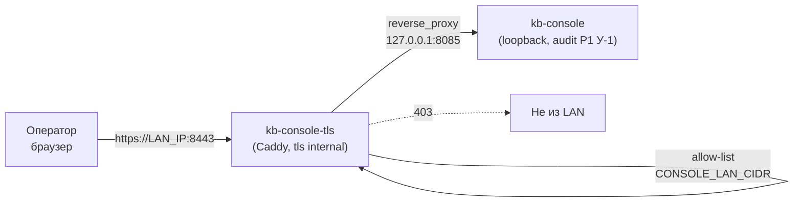

# 🖥️ Доступ к kb-console из локальной сети (TLS-фасад)

**Трасса:** `code-2026-09-26-030` | **Область:** kb-console, docker-compose (dev/prod), ansible no-proxy
**Назначение:** дать операторам на других компьютерах работать с консолью в пределах
локальной сети — без туннелей, но и без публикации Basic-пароля в открытом виде.

## 1. Зачем фасад (и почему нельзя просто открыть :8085)

Консоль защищена **HTTP Basic**, а Basic передаёт `base64(user:пароль)` в каждом
запросе — это не шифрование. Прямая публикация `:8085` в сеть означала бы, что пароль
оператора виден любому в той же сети и **на каждом прокси по пути** (диагностировано
2026-09-26: корпоративный Squid отвечал 403 на внутренний адрес — то есть трафик
консоли идёт через прокси, который видел бы и заголовок `Authorization`).

Поэтому действует правило проекта (`kb-console/USER_GUIDE.md`): **прямая публикация
порта без TLS запрещена**. Схема:



Что даёт: пароль не ходит в открытом виде (TLS), доступ ограничен подсетью
(allow-list), HSTS, консоль остаётся loopback-сервисом, аутентификация и роли —
per-user (см. §5). Фасад **fail-closed**: без `CONSOLE_LAN_IP` контейнер не стартует
(иначе `bind 0.0.0.0` выставил бы консоль во все сети хоста, включая внутренние
лаб-сети `virbr*`).

## 2. Переменные

| Переменная | Где | Назначение |
|---|---|---|
| `CONSOLE_LAN_IP` | `.env` | IP-адрес LAN-интерфейса, на котором слушает фасад (здесь `192.168.2.3`) |
| `CONSOLE_LAN_CIDR` | `.env` | Подсеть, которой разрешён доступ (здесь `192.168.2.0/24`) |
| `CONSOLE_ADMIN_USER` / `CONSOLE_ADMIN_PASSWORD` | `.env` | Bootstrap-админ консоли (создаётся в `users.jsonl` при старте) |
| `MCP_API_KEY_ADMIN` / `_EDITOR` / `_CONTRIBUTOR` | `.env` | Ключи, которыми консоль ходит в MCP от имени роли |
| `console_lan_ip` | `ansible/inventory/group_vars/all.yml` | Тот же адрес для `NO_PROXY` на хосте (офис — своё значение) |

Соответствие «роль консоли → уровень сервера»: `admin → MCP_WRITE_KEYS`,
`editor → токен уровня editor (TokenStore)`, `contributor → MCP_IMPORT_KEYS`.
Подробности — §5.

## 3. Деплой

```bash
# штатный путь: preflight → push → deploy → verify (шаг V5 проверяет фасад в LAN)
make push

# только фасад (если остальное не менялось)
docker compose up -d kb-console-tls
docker compose logs -f kb-console-tls        # JSON-лог Caddy, ошибок быть не должно
```

`kb-console-tls` описан в `docker-compose.yml` и `docker-compose.prod.yml`
(`network_mode: host`, конфиг `kb-console/caddy/Caddyfile`, стор `data/caddy/`).

## 4. Проверка

```bash
make verify-deploy                     # V4 (консоль) + V5 (TLS-фасад в LAN) — ожидаем 5/5

# вручную (--noproxy обязателен: иначе запрос уйдёт в корпоративный прокси)
curl --noproxy '*' -k -o /dev/null -w '%{http_code}\n' https://192.168.2.3:8443/     # 401
curl --noproxy '*' -k -u "$CONSOLE_ADMIN_USER:$CONSOLE_ADMIN_PASSWORD" \
     -o /dev/null -w '%{http_code}\n' https://192.168.2.3:8443/                     # 200
docker exec kb-console-tls caddy validate --config /etc/caddy/Caddyfile --adapter caddyfile
```

Ожидаемые сигналы: без кредов **401 + `WWW-Authenticate: Basic realm="kb-console"`**,
с кредами **200**, `Strict-Transport-Security` в ответе, в `docker logs kb-console-tls`
**0 ошибок**, `ss -ltn` не показывает листенер на `:80` (redirect отключён намеренно).

## 5. Учётные записи операторов

Пока `data/console/users.jsonl` пуст, действует единый legacy-пароль
(`CONSOLE_PASSWORD`) и **все входят как admin**. Для нескольких операторов это
неверно, поэтому:

1. Задайте `CONSOLE_ADMIN_USER`/`CONSOLE_ADMIN_PASSWORD` в `.env` → при старте
   консоль создаёт админа (bootstrap, идемпотентно). После этого legacy-пароль
   **перестаёт действовать** (per-user стор — SSOT).
2. Войдите админом → страница **«Пользователи»** → создайте учётки операторов.
   Пароль показывается **один раз** — передайте владельцу; далее только сброс.
3. Роли: `admin` (полный доступ + пользователи), `editor` (правки контента без
   `reindex`/`set_zone`/`bulk_*`), `contributor` (чтение + импорт). Аудит —
   `data/console/users_audit.jsonl` (кто создан/сменён/входил).
4. Деактивация вместо удаления — запись остаётся в аудите.

### Per-role ключи MCP (серверная граница, не только UI)

| Роль | Источник ключа | Уровень на сервере |
|---|---|---|
| admin | `MCP_API_KEY_ADMIN` в `MCP_WRITE_KEYS` | `write` — всё |
| editor | токен TokenStore `--level editor` | `editor` — read + editor-тулы |
| contributor | `MCP_API_KEY_CONTRIBUTOR` в `MCP_IMPORT_KEYS` | `import` — read + `import_content` |

Уровень `editor` нельзя задать через env (env-списки только read/write/import), он
живёт в токен-сторе — поэтому editor-ключ создаётся штатным CLI:

```bash
docker exec mcp-knowledge-server python -m mcp_server.cli token create \
    --level editor --zone both --note "kb-console editor"
# plaintext печатается ОДИН раз → положить в .env как MCP_API_KEY_EDITOR → перезапустить kb-console
docker compose up -d kb-console

# ротация/отзыв (docs/key-rotation.md)
docker exec mcp-knowledge-server python -m mcp_server.cli token rotate <token_id>
docker exec mcp-knowledge-server python -m mcp_server.cli token revoke <token_id>
```

Проверка границ (без мутаций контента): editor-ключом `reindex`/`set_zone` дают
**403**, `write_knowledge` с заведомо неверными аргументами — ошибку валидации
(не 403); contributor-ключом `write_knowledge` → **403**, `import_content` разрешён.

## 6. Сертификат для операторов

Caddy генерирует локальный CA сам (`tls internal`), сертификат продлевается
автоматически. Корневой сертификат лежит на хосте:

```
data/caddy/data/caddy/pki/authorities/local/root.crt
```

Раздать/установить один раз на машине оператора (или принять предупреждение браузера):

```bash
# Linux (Debian/Ubuntu)
sudo cp root.crt /usr/local/share/ca-certificates/kb-console-lan.crt && sudo update-ca-certificates
# macOS
sudo security add-trusted-cert -d -r trustRoot -k /Library/Keychains/System.keychain root.crt
# Windows (PowerShell, от админа)
Import-Certificate -FilePath root.crt -CertStoreLocation Cert:\LocalMachine\Root
```

При ротации CA (пересоздание `data/caddy` без бэкапа) сертификат нужно раздать заново.

## 7. Прокси (обязательный шаг для операторов)

Симптом: браузер отдаёт **403** и в заголовках `Server: squid`, `X-Squid-Error:
ERR_ACCESS_DENIED` — это прокси, а не консоль.

- **Хост:** сделано — `NO_PROXY`/`no_proxy` в `~/.bashrc` содержит `192.168.2.3`;
  в офисе — `console_lan_ip` в `ansible/inventory/group_vars/all.yml`
  (`mcp_kb_host_prepare__no_proxy` шаблонится в `http-proxy.conf.j2`).
- **Браузер оператора:** добавить адрес консоли в исключения прокси
  (Chrome/Chromium: `--proxy-bypass-list="192.168.2.3;localhost"` или системные
  настройки; Firefox: Настройки → Сеть → Исключения).
- **CLI:** всегда `curl --noproxy '*'` для внутренних адресов.

## 8. Troubleshooting

| Симптом | Причина | Действие |
|---|---|---|
| 403 + `Server: squid` | запрос ушёл в прокси | исключить адрес из прокси (§7) |
| 403 + текст «доступ только из локальной сети» | источник вне `CONSOLE_LAN_CIDR` | проверить подсеть/VPN-адрес |
| 000 / нет ответа | фасад не поднят или упал fail-closed | `docker ps \| grep kb-console-tls`, `docker logs kb-console-tls`, проверить `CONSOLE_LAN_IP` |
| 401 без запроса пароля | `CONSOLE_AUTH=off` | выставить `required` в `.env`, перезапустить |
| 401 с верными кредами | активен per-user стор, а вы вводите legacy-пароль | вход по bootstrap-админу/личной учётке (§5) |
| Предупреждение сертификата | CA не установлен на машине оператора | §6 |
| Консоль недоступна с хоста по `https://LAN_IP` | так и должно быть, если консоль в auth-режиме | используйте креды; без кредов ожидаем 401 |
| WS-ошибки в Safari | Safari не шлёт Basic на websocket-upgrade | штатный HTTP-polling, не ошибка (USER_GUIDE) |

## 9. Переносимость в офис

1. Определить LAN-адрес хоста и подсеть → `CONSOLE_LAN_IP`, `CONSOLE_LAN_CIDR` в `.env`
   (+ `console_lan_ip` в ansible-inventory).
2. `make push` (или `docker compose up -d kb-console-tls`) на целевом хосте.
3. Раздать операторам `root.crt` (§6) и исключение прокси (§7).
4. Завести учётки операторов с ролями (§5).
5. Проверить `make verify-deploy` → V5 PASS.

## 10. Безопасность: что закрыто

- Пароли не ходят в открытом виде (TLS), HSTS, `-Server`.
- Доступ ограничен подсетью (allow-list) поверх TLS.
- Консоль остаётся `127.0.0.1` (нет порта в сети у самого сервиса).
- `admin off` у Caddy — нет admin-API.
- Отключён HTTP-redirect `:80` (в host-сети он слушал бы все интерфейсы).
- Роли ограничены и в UI, и на сервере (per-role ключи), есть аудит входов и действий.
- `.env` (секреты) — права `600`, в git не попадает.

## 11. Затронутые файлы

| Файл | Что |
|---|---|
| `kb-console/caddy/Caddyfile` | конфиг фасада (TLS internal, bind, allow-list, HSTS) |
| `docker-compose.yml`, `docker-compose.prod.yml` | сервис `kb-console-tls` (+ fail-closed гард) |
| `scripts/verify-deploy.sh` | V4 — per-user креды, V5 — TLS-фасад в LAN |
| `ansible/inventory/group_vars/all.yml` | `console_lan_ip` → `NO_PROXY` |
| `kb-console/USER_GUIDE.md` | раздел доступа из LAN |
| `docs/operations/console-lan-access.md` | этот runbook |
| `tests/test_console_tls_facade.py` | инварианты фасада (статика + `caddy validate`) |

---
**v1.0** | 2026-09-26 | Создано в трассе `code-2026-09-26-030`.
