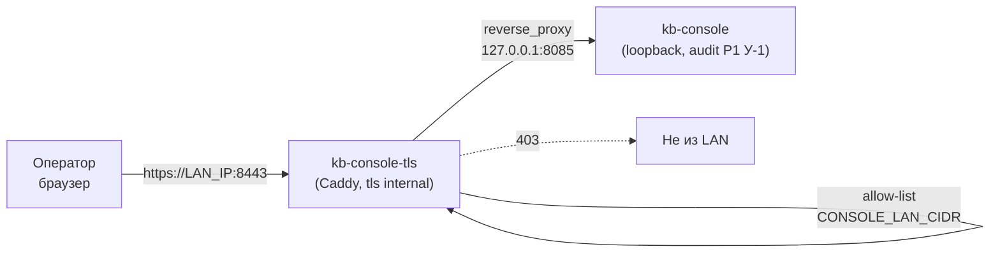

# 🖥️ Доступ к kb-console из локальной сети (TLS-фасад)

**Трасса:** `code-2026-09-26-030` | **Область:** kb-console, docker-compose (dev/prod), ansible no-proxy
**Назначение:** дать операторам на других компьютерах работать с консолью в пределах
локальной сети — без туннелей, но и без публикации Basic-пароля в открытом виде.

## 1. Зачем фасад (и почему нельзя просто открыть :8085)

Консоль защищена **HTTP Basic**, а Basic передаёт `base64(user:пароль)` в каждом
запросе — это не шифрование. Прямая публикация `:8085` в сеть означала бы, что пароль
оператора виден любому в той же сети и **на каждом прокси по пути** (диагностировано
2026-09-26: корпоративный Squid отвечал 403 на внутренний адрес — то есть трафик
консоли идёт через прокси, который видел бы и заголовок `Authorization`).

Поэтому действует правило проекта (`kb-console/USER_GUIDE.md`): **прямая публикация
порта без TLS запрещена**. Схема:



Что даёт: пароль не ходит в открытом виде (TLS), доступ ограничен подсетью
(allow-list), HSTS, консоль остаётся loopback-сервисом, аутентификация и роли —
per-user (см. §5). Фасад **fail-closed**: без `CONSOLE_LAN_IP` контейнер не стартует
(иначе `bind 0.0.0.0` выставил бы консоль во все сети хоста, включая внутренние
лаб-сети `virbr*`).

## 2. Переменные

| Переменная | Где | Назначение |
|---|---|---|
| `CONSOLE_LAN_IP` | `.env` | IP-адрес LAN-интерфейса, на котором слушает фасад (здесь `192.168.2.3`) |
| `CONSOLE_LAN_CIDR` | `.env` | Подсеть, которой разрешён доступ (здесь `192.168.2.0/24`) |
| `CONSOLE_ADMIN_USER` / `CONSOLE_ADMIN_PASSWORD` | `.env` | Bootstrap-админ консоли (создаётся в `users.jsonl` при старте) |
| `MCP_API_KEY_ADMIN` / `_EDITOR` / `_CONTRIBUTOR` | `.env` | Ключи, которыми консоль ходит в MCP от имени роли |
| `console_lan_ip` | `ansible/inventory/group_vars/all.yml` | Тот же адрес для `NO_PROXY` на хосте (офис — своё значение) |

Соответствие «роль консоли → уровень сервера»: `admin → MCP_WRITE_KEYS`,
`editor → токен уровня editor (TokenStore)`, `contributor → MCP_IMPORT_KEYS`.
Подробности — §5.

## 3. Деплой

```bash
# штатный путь: preflight → push → deploy → verify (шаг V5 проверяет фасад в LAN)
make push

# только фасад (если остальное не менялось)
docker compose up -d kb-console-tls
docker compose logs -f kb-console-tls        # JSON-лог Caddy, ошибок быть не должно
```

`kb-console-tls` описан в `docker-compose.yml` и `docker-compose.prod.yml`
(`network_mode: host`, конфиг `kb-console/caddy/Caddyfile`, стор `data/caddy/`).

### 3.1 Фаервол — обязательный шаг (иначе снаружи таймаут)

На хостах с `ufw` и политикой `DEFAULT_INPUT_POLICY=DROP` (так на `lup`) весь
входящий трафик дропается: **изнутри хоста всё работает, с других машин —
`ERR_CONNECTION_TIMED_OUT`**. Диагностировано 2026-09-26 (трасса 030): были
недоступны и `kb-console-tls:8443`, и MCP `:8000`.

```bash
# порт TLS-фасада консоли
sudo ufw allow from 192.168.2.0/24 to any port 8443 proto tcp comment 'kb-console TLS facade (030)'
# если с других машин нужен сам MCP-сервер
sudo ufw allow from 192.168.2.0/24 to any port 8000 proto tcp comment 'MCP knowledge server (LAN)'
sudo ufw status numbered | grep -E '8443|8000'
```

Подсеть в правиле должна совпадать с `CONSOLE_LAN_CIDR` (allow-list фасада).
Автоматизация для новых хостов — `ansible/playbooks/host-prepare.yml`
(переменные `mcp_kb_host_prepare__lan_cidr`, `mcp_kb_host_prepare__lan_ports`;
модуль `community.general.ufw`). Проверка снаружи (не с хоста!):

```bash
# Windows: Test-NetConnection 192.168.2.3 -Port 8443
# Linux:   nc -z -w 3 192.168.2.3 8443 && echo open
```

**Порт 80 (удобный вход).** Фасад слушает `http://<LAN_IP>/` только чтобы **редиректить**
на `https://<LAN_IP>:8443` (оператор, набравший адрес без схемы/порта, не получает
ошибку). Консоль по открытому http **не проксируется** — инвариант проверяется тестом.
Если нужен и этот вход с других машин: `sudo ufw allow 80/tcp comment 'kb-console http→https redirect'`.

> ℹ️ Без правила ufw на 80 доступен только локально: на хостах с `DEFAULT_INPUT_POLICY=DROP`
> порт по умолчанию закрыт. На `https://…:8443` правило обязательно (§выше).
> ⚠️ Изменение `Caddyfile` в bind-mount **не подхватывается на лету** (`admin off` →
> `caddy reload` недоступен): после правки конфига — `docker restart kb-console-tls`
> (или `make push`, который пересоздаёт контейнер).

## 4. Проверка

```bash
make verify-deploy                     # V4 (консоль) + V5 (TLS-фасад в LAN) — ожидаем 5/5

# вручную (--noproxy обязателен: иначе запрос уйдёт в корпоративный прокси)
curl --noproxy '*' -k -o /dev/null -w '%{http_code}\n' https://192.168.2.3:8443/     # 401
curl --noproxy '*' -k -u "$CONSOLE_ADMIN_USER:$CONSOLE_ADMIN_PASSWORD" \
     -o /dev/null -w '%{http_code}\n' https://192.168.2.3:8443/                     # 200
docker exec kb-console-tls caddy validate --config /etc/caddy/Caddyfile --adapter caddyfile
```

Ожидаемые сигналы: без кредов **401 + `WWW-Authenticate: Basic realm="kb-console"`**,
с кредами **200**, `Strict-Transport-Security` в ответе, в `docker logs kb-console-tls`
**0 ошибок**, `ss -ltn` не показывает листенер на `:80` (redirect отключён намеренно).

Healthcheck самого фасада — **TCP-liveness** (`nc -z -w 3 $CONSOLE_LAN_IP 8443`):
`wget` на ответ 401 отдаёт exit≠0 и даёт ложный `unhealthy` (проверено на деплое 030).
Корректность TLS/HTTP проверяет V5.

**Проверка websocket через фасад** (NiceGUI без него не работает; V5 этого не видит):

```bash
# HTML и WS-хендшейк с Basic-кредами (python-сниппет или любой WS-клиент):
#   GET /_nicegui_ws/socket.io/?EIO=4&transport=websocket + Authorization: Basic …
#   → ожидаем "HTTP/1.1 101 Switching Protocols"
```
Живой прогон 030: HTML фасада — **200** (9 289 байт, NiceGUI 3.17.1), WS-хендшейк —
**101 Switching Protocols**, в логе Caddy 0 ошибок. То есть Basic-auth закрывает и WS
(обход через upgrade невозможен), а TLS-фасад пропускает upgrade.

> ℹ️ `curl` по этому адресу без `-k` покажет ошибку проверки сертификата
> (`ssl_verify_result=20` — локальный CA не в системном хранилище). Для CLI —
> `curl -k` или установить `root.crt` (§6); браузер после установки CA — без предупреждений.

## 5. Учётные записи операторов

Пока `data/console/users.jsonl` пуст, действует единый legacy-пароль
(`CONSOLE_PASSWORD`) и **все входят как admin**. Для нескольких операторов это
неверно, поэтому:

1. Задайте `CONSOLE_ADMIN_USER`/`CONSOLE_ADMIN_PASSWORD` в `.env` → при старте
   консоль создаёт админа (bootstrap, идемпотентно). После этого legacy-пароль
   **перестаёт действовать** (per-user стор — SSOT).
2. Войдите админом → страница **«Пользователи»** → создайте учётки операторов.
   Пароль показывается **один раз** — передайте владельцу; далее только сброс.
3. Роли: `admin` (полный доступ + пользователи), `editor` (правки контента без
   `reindex`/`set_zone`/`bulk_*`), `contributor` (чтение + импорт). Аудит —
   `data/console/users_audit.jsonl` (кто создан/сменён/входил).
4. Деактивация вместо удаления — запись остаётся в аудите.

### Per-role ключи MCP (серверная граница, не только UI)

| Роль | Источник ключа | Уровень на сервере |
|---|---|---|
| admin | `MCP_API_KEY_ADMIN` в `MCP_WRITE_KEYS` | `write` — всё |
| editor | токен TokenStore `--level editor` | `editor` — read + editor-тулы |
| contributor | `MCP_API_KEY_CONTRIBUTOR` в `MCP_IMPORT_KEYS` | `import` — read + `import_content` |

Уровень `editor` нельзя задать через env (env-списки только read/write/import), он
живёт в токен-сторе — поэтому editor-ключ создаётся штатным CLI:

```bash
docker exec mcp-knowledge-server python -m mcp_server.cli token create \
    --level editor --zone both --note "kb-console editor"
# plaintext печатается ОДИН раз → положить в .env как MCP_API_KEY_EDITOR → перезапустить kb-console
docker compose up -d kb-console

# ротация/отзыв (docs/key-rotation.md)
docker exec mcp-knowledge-server python -m mcp_server.cli token rotate <token_id>
docker exec mcp-knowledge-server python -m mcp_server.cli token revoke <token_id>
```

Проверка границ (без мутаций контента): editor-ключом `reindex`/`set_zone` дают
**403**, `write_knowledge` с заведомо неверными аргументами — ошибку валидации
(не 403); contributor-ключом `write_knowledge` → **403**, `import_content` разрешён.

> ⚠️ **Как выглядит отказ на транспорте (проверено живьём, трасса 030):** запрет
> приходит **внутри JSON-RPC — HTTP 200 + `error.code = -32002`**, текст
> `Forbidden: <level> key cannot access tool '<tool>'`. Мониторить только HTTP-код
> бесполезно. На серверной стороне каждый отказ попадает в лог:
> `Auth FORBIDDEN: <level>-key attempted <tool>` (logger.warning) → виден в sink
> Error→Rule через `docker logs mcp-knowledge-server`.

Живой прогон 030 (7/7): admin `errors_query` — разрешён; editor `errors_query`/
`set_zone` — запрещены, `delete_entry` — разрешён; contributor `write_knowledge` —
запрещён, `search_knowledge` — разрешён; read `write_knowledge` — запрещён.

## 6. Сертификат для операторов

Caddy генерирует локальный CA сам (`tls internal`), сертификат продлевается
автоматически. Файлы лежат в volume фасада: `/data/caddy/pki/authorities/local/`
(на хосте — `data/caddy/data/caddy/pki/authorities/local/`, каталог принадлежит
root).

**Самый простой путь для оператора (без пересылки файлов):** открыть в браузере
`http://<LAN_IP>/root.crt` — фасад отдаёт корневой сертификат с типом
`application/x-x509-ca-cert` → сохранить → «Установить сертификат» → **Локальный
компьютер** → **Доверенные корневые центры сертификации**. После этого
`https://<LAN_IP>:8443` открывается без предупреждений. В офисе это единственное
действие на машину (или раскатать через GPO).

Забрать сертификат на сервере/скриптом (без sudo):

```bash
curl -s http://<LAN_IP>/root.crt -o root.crt          # с любой машины
docker exec kb-console-tls cat /data/caddy/pki/authorities/local/root.crt > root.crt
# либо: sudo cp data/caddy/data/caddy/pki/authorities/local/root.crt .
```

Перед установкой сверяйте отпечаток SHA-256 (защита от подмены на пути):

```bash
openssl x509 -in root.crt -noout -fingerprint -sha256
```

Раздать/установить один раз на машине оператора (или принять предупреждение браузера):

```bash
# Linux (Debian/Ubuntu)
sudo cp root.crt /usr/local/share/ca-certificates/kb-console-lan.crt && sudo update-ca-certificates
# macOS
sudo security add-trusted-cert -d -r trustRoot -k /Library/Keychains/System.keychain root.crt
# Windows (PowerShell, от админа)
Import-Certificate -FilePath root.crt -CertStoreLocation Cert:\LocalMachine\Root
```

При ротации CA (пересоздание `data/caddy` без бэкапа) сертификат нужно раздать заново.

### 6.1 Проверка доверия без браузера

Быстрый способ отделить «сертификат» от «прокси/браузера» (Windows, PowerShell):

```powershell
certutil -store Root 2>$null | findstr /I Caddy   # CA должен быть в МАШИННОМ хранилище
curl.exe --ssl-no-revoke -sS -o NUL -w "code=%{http_code}`n" https://<LAN_IP>:8443/
# ожидаем code=401 («нужен логин»). Без --ssl-no-revoke curl падает с 0x80092012 —
# у локального CA нет CRL/OCSP, а curl проверяет отзыв строго; браузеры проверяют мягко.
```

```powershell
# вход с кредами без браузера: ожидаем 200 и ~9 КБ HTML
$u='admin'; $sec=Read-Host "Пароль" -AsSecureString
$p=[Runtime.InteropServices.Marshal]::PtrToStringAuto([Runtime.InteropServices.Marshal]::SecureStringToBSTR($sec))
Invoke-WebRequest 'https://<LAN_IP>:8443/' -UseBasicParsing -Headers @{Authorization=('Basic ' + [Convert]::ToBase64String([Text.Encoding]::ASCII.GetBytes("$u`:$p")))} | Select-Object StatusCode
```

## 7. Прокси (обязательный шаг для операторов)

Симптом: браузер отдаёт **403** и в заголовках `Server: squid`, `X-Squid-Error:
ERR_ACCESS_DENIED` — это прокси, а не консоль.

- **Хост:** сделано — `NO_PROXY`/`no_proxy` в `~/.bashrc` содержит `192.168.2.3`;
  в офисе — `console_lan_ip` в `ansible/inventory/group_vars/all.yml`
  (`mcp_kb_host_prepare__no_proxy` шаблонится в `http-proxy.conf.j2`).
- **Браузер оператора:** добавить адрес консоли в исключения прокси
  (Chrome/Chromium: `--proxy-bypass-list="192.168.2.3;localhost"` или системные
  настройки; Firefox: Настройки → Сеть → Исключения).
- **CLI:** всегда `curl --noproxy '*'` для внутренних адресов.

## 8. Troubleshooting

| Симптом | Причина | Действие |
|---|---|---|
| **Таймаут / `ERR_CONNECTION_TIMED_OUT` с другой машины** (локально на хосте всё работает) | фаервол: `ufw` c `DEFAULT_INPUT_POLICY=DROP` без правила для порта | добавить правило (§3.1) |
| 400 от Caddy при `http://…:8443` | запрос ушёл в открытом виде на TLS-порт (HTTP-листенера нет) | открывать **`https://`** |
| 403 + `Server: squid` | запрос ушёл в прокси | исключить адрес из прокси (§7) |
| 403 + текст «доступ только из локальной сети» | источник вне `CONSOLE_LAN_CIDR` | проверить подсеть/VPN-адрес |
| 000 / нет ответа | фасад не поднят или упал fail-closed | `docker ps \| grep kb-console-tls`, `docker logs kb-console-tls`, проверить `CONSOLE_LAN_IP` |
| 401 без запроса пароля | `CONSOLE_AUTH=off` | выставить `required` в `.env`, перезапустить |
| 401 с верными кредами | активен per-user стор, а вы вводите legacy-пароль | вход по bootstrap-админу/личной учётке (§5) |
| Предупреждение сертификата | CA не установлен на машине оператора | §6 |
| Консоль недоступна с хоста по `https://LAN_IP` | так и должно быть, если консоль в auth-режиме | используйте креды; без кредов ожидаем 401 |
| WS-ошибки в Safari | Safari не шлёт Basic на websocket-upgrade | штатный HTTP-polling, не ошибка (USER_GUIDE) |

### 8.1 Живые грабли (проверено при первом подключении оператора, 2026-09-26)

| Симптом | Что это на самом деле | Действие |
|---|---|---|
| `curl.exe` → `schannel: 0x80092012 - Функция отзыва не смогла произвести проверку отзыва` | у локального CA нет CRL/OCSP, а `curl.exe` проверяет отзыв строго. **Не дефект консоли и не про браузер** (Chromium проверяет мягко) | тестировать с `--ssl-no-revoke` либо `Invoke-WebRequest` (§6.1): `401` без кредов, `200` с ними |
| Сертификат установлен, но Chrome «не работает» | залипший в профиле `Alt-Svc h3`: фасад анонсировал QUIC, Chrome помнит его до 30 дней, а UDP-8443 закрыт фаерволом | `chrome://net-internals/#sockets` → *Flush socket pools*; `chrome://net-internals/#hsts` → удалить адрес; `chrome://restart`. В `Caddyfile` h3 уже отключён (`servers { protocols h1 h2 }`) — не включать, пока UDP не открыт |
| Сертификат «установлен», а доверия нет | попал в пользовательское хранилище, а Chrome/службы смотрят в машинное | ставить в **«Локальный компьютер» → «Доверенные корневые»** (§6); проверка: `certutil -store Root \| findstr Caddy` |
| Непонятно, дошёл ли запрос оператора | access-логи фасада включены (`log { output stdout format json }` в обоих сайтах) | `docker logs kb-console-tls --since 5m` → `remote_ip`, `status`, `User-Agent`. **Тишина в логе ≠ прокси:** при ошибке сертификата браузер вообще не отправляет HTTP, поэтому записи нет; при неверном пароле будет `401` |
| Браузер грузит страницу рывками/висит | пробует QUIC (выше) либо уходит в прокси (§7) | см. строки выше и §7 |

## 9. Переносимость в офис

1. Определить LAN-адрес хоста и подсеть → `CONSOLE_LAN_IP`, `CONSOLE_LAN_CIDR` в `.env`
   (+ `console_lan_ip` в ansible-inventory). **Учесть удалённые подсети:** операторы могут
   приходить не из LAN (пример: VPN-пул `10.8.x` — так подключался первый оператор).
   Тогда `CONSOLE_LAN_CIDR`/ufw-правило должны покрывать и LAN, и VPN-пул; «только LAN»
   отрежет удалённых операторов (симптом — 403 «доступ только из локальной сети»).
2. `make push` (или `docker compose up -d kb-console-tls`) на целевом хосте.
3. Раздать операторам `root.crt` (§6) и исключение прокси (§7).
4. Завести учётки операторов с ролями (§5).
5. Проверить `make verify-deploy` → V5 PASS.

## 10. Безопасность: что закрыто

- Пароли не ходят в открытом виде (TLS), HSTS, `-Server`.
- Доступ ограничен подсетью (allow-list) поверх TLS.
- Консоль остаётся `127.0.0.1` (нет порта в сети у самого сервиса).
- `admin off` у Caddy — нет admin-API.
- Отключён HTTP-redirect `:80` (в host-сети он слушал бы все интерфейсы).
- Роли ограничены и в UI, и на сервере (per-role ключи), есть аудит входов и действий.
- `.env` (секреты) — права `600`, в git не попадает.

## 11. Затронутые файлы

| Файл | Что |
|---|---|
| `kb-console/caddy/Caddyfile` | конфиг фасада (TLS internal, bind, allow-list, HSTS) |
| `docker-compose.yml`, `docker-compose.prod.yml` | сервис `kb-console-tls` (+ fail-closed гард) |
| `scripts/verify-deploy.sh` | V4 — per-user креды, V5 — TLS-фасад в LAN |
| `ansible/inventory/group_vars/all.yml` | `console_lan_ip` → `NO_PROXY` |
| `kb-console/USER_GUIDE.md` | раздел доступа из LAN |
| `docs/operations/console-lan-access.md` | этот runbook |
| `tests/test_console_tls_facade.py` | инварианты фасада (статика + `caddy validate`) |

---
**v1.0** | 2026-09-26 | Создано в трассе `code-2026-09-26-030`.
