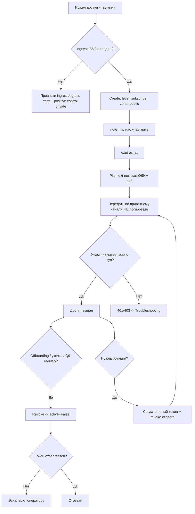

# 🎫 Runbook: выдача и отзыв subscriber-токенов MCP-сервера (AI-верстак)

## 1. Контекст и когда применять

Решение оператора **2026-10-07**: для участников AI-верстака выбран **вариант (1) — per-user subscriber-токены**. Каждый участник (D1 = **5** человек) ходит в MCP-сервер mcp-knowledge **своим клиентом** (Kilo / Cline / Claude Code); сервер доступен им по ingress.

Ключевой инвариант безопасности: **зона у subscriber принудительно `public`**. Зона `private` недоступна по построению, поэтому инвариант «private → только локальная модель» (**I5**) не нарушается.

Источник политики: `docs/operations/ws-egress-152fz-policy.md` **§6** (утверждена, `status: active`).

Применяй runbook когда нужно:
- выдать доступ новому участнику (onboarding),
- отозвать доступ при завершении участия (offboarding),
- отреагировать на подозрение на утечку/компрометацию,
- сменить токен плановой ротацией,
- отреагировать на баннер авто-деактивации **Q9** (неактивность > 90 дней).

## 2. Роли и область

| Роль | Действия |
|------|----------|
| **Оператор** | Выдаёт токен через kb-console, передаёт plaintext по приватному каналу, фиксирует атрибуцию в `note`, выполняет revoke/rotate |
| **Проверяющий (ingress/egress, Б6.2)** | Подтверждает, что ingress-тест пройден и positive control (subscriber **не** читает private) выполняется |
| **Участник** | Хранит токен у себя, использует только в своём клиенте, не публикует и не коммитит |

## 3. Предусловия

1. **Ingress/egress-тест (Б6.2) пройден** — обязателен **ДО первой выдачи** токена.
   - positive control: subscriber-токен **не может** прочитать private-запись (ожидаемый ответ — ошибка доступа).
2. Доступ оператора к kb-console (страница **«Токены»**), вход выполнен.
3. Участник известен: определён **алиас/хэндл** для атрибуции (псевдонимизация, минимум ПД).

## 4. Процедура выдачи (onboarding)

Штатный путь — UI kb-console, страница **«Токены»** (`kb-console/src/kb_console/pages/tokens.py`). API-эквиваленты: `GET/POST /tokens`, `POST /tokens/{id}/revoke|rotate`, `PATCH /tokens/{id}`.

1. Открой страницу **«Токены»** → **Create**.
2. Уровень (level) — **`subscriber`**, зона (zone) — **`public`** (значения по умолчанию для этого сценария).
3. Заполни поле **`note`** атрибуцией участника (см. §7). Пример: `note="participant: ivan (D1)"`.
4. Задай **`expires_at`** (при необходимости ограничить срок жизни).
5. Создай токен. **Plaintext показывается РОВНО ОДИН РАЗ** в момент создания (`create()`); в хранилище остаётся только `key_hash = sha256` (`token_store.py:15-19, 73-75, 248-293`).
6. **Скопируй plaintext сразу** и передай участнику по **приватному каналу** (личка TG и т.п.).
7. **НЕ логируй** токен: ни в чат, ни в тикеты, ни в коммиты, ни в файлы репозитория.
8. Убедись, что участник проверил доступ: например, вызвал `search_knowledge` и получил результат; вызов public-тула без `FORBIDDEN`.

Формат токена: `mcp_<level><zone>_<secret32>`; subscriber → `mcp_sa_...` (s = subscriber, a = public). Секрет — 32 символа base62 (≥ 190 бит).

Белый список subscriber — **10 read-тулов** контура A (`auth.py:125-137`): `search_knowledge, search_by_tags, get_entry, get_knowledge_map, list_domains, list_subjects, list_projects, list_collections, find_fragment, analyze_content`. Внутренние quality-тулы, `resources/*`, `prompts/*` — subscriber недоступны (`auth.py:120-124`).

## 5. Процедура отзыва (offboarding / утечка / ротация)

1. На странице **«Токены»** найди запись по `note` (алиас участника).
2. Нажми **Revoke** (или `POST /tokens/{id}/revoke`). Revoke = `active=False`; **строка физически не удаляется** из `tokens.jsonl`.
3. **Немедленная проверка отзыва:** убедись, что токен отвергается — запрос с этим токеном возвращает ошибку аутентификации/доступа (401/403), не результат.
4. При участии в кампании/лабе с кредитом — обнови учётную документацию согласно процессу.
5. Уведоми участника о прекращении доступа (по приватному каналу).

## 6. Ротация и изменение `note`/`expiry`

**Ротация** (плановое обновление или после подозрения на утечку):
1. Создай **новый** токен (level `subscriber`, zone `public`) с тем же `note`.
2. Передай новый plaintext участнику по приватному каналу (plaintext отдаётся один раз).
3. **Revoke старый** токен.
   - rotate-операция (UI / `POST /tokens/{id}/rotate`) выполняет «новый токен + revoke старого» как единое действие.

**Изменение `note`/`expires_at`** (без смены секрета):
- На странице «Токены» отредактируй `note` / `expires_at` → `PATCH /tokens/{id}`.
- `note` — SSOT атрибуции токен ↔ участник; держи его актуальным.

## 7. Атрибуция и retention

- **Атрибуция токен ↔ участник** — через поле `note` (свободный текст). Храни **минимальные ПД**: алиас/хэндл участника (псевдонимизация), **НЕ** полные ФИО/контакты.
  - Пример: `note="participant: ivan (D1)"`.
- Реестр соответствий алиас ↔ личность (если ведётся) — **только в приватной зоне**.
- **Q9 (retention):** `deactivate_stale(max_inactive_days=90)` (`token_store.py:26-29, 375`) деактивирует subscriber при неактивности > **90 дней**. База отсчёта — `last_used_at`, иначе `created_at`.
- **Warning-окно:** за **7 дней** до деактивации (`EXPIRING_SOON_DAYS=7`, `token_store.py:62`) в консоли появляется баннер «скоро деактивация» с кнопкой revoke (`pages/tokens.py:30, 83-87, 194-204`).
- **Физического удаления нет** — отзыв выражается через `active=False`; записи в `tokens.jsonl` сохраняются.

## 8. Ревокация / авто-деактивация по баннеру Q9

1. Баннер «скоро деактивация» на странице «Токены» → определи участника по `note`.
2. Реши исход:
   - **Участник всё ещё нужен** → сделай **rotate** (новый токен, затем revoke старого) или измени `expires_at`.
   - **Участник больше не нужен** → **Revoke**.
3. Не оставляй баннер без реакции: без ручного действия авто-деактивация сегодня не сработает (см. §10).

## 9. Troubleshooting

| Симптом | Причина | Действие |
|---------|---------|----------|
| **401** у subscriber | токен неверен/истёк/отозван; plaintext передан неполно | Проверить `note`/`active`/`expires_at` в консоли; при необходимости **rotate** и передать новый plaintext |
| **403** у subscriber | вызов вне белого списка 10 read-тулов, либо попытка выйти за пределы зоны | Объяснить участнику границу доступа (только 10 read-тулов контура A, зона public) |
| **429** | превышен лимит subscriber — отдельный bucket **~45 req/min** (`auth.py:576-578`) | Дождаться окна, снизить частоту/батчить запросы клиента |
| «private недоступен» | **ожидаемое поведение**: зона subscriber принудительно `public` (`auth.py:291-293`, `auth.py:348-356`) | Не «чинить» — доступ к private не предусмотрен по построению |
| Plaintext потерян | plaintext отдаётся один раз (`create()`) | **Rotate** → новый токен → передать заново |
| Баннер **Q9** «скоро деактивация» | неактивность ≥ 83 дней (warning-окно) | Revoke (если доступ не нужен) или Rotate/продлить `expires_at` |

## 10. Известные ограничения

- **Q9 без авто-триггера (известный остаток):** вызова `deactivate_stale()` в расписании / cron / API **нет**. Сегодня авто-деактивация Q9 срабатывает **только вручную** — через консольный баннер. Автоматический триггер — задача **P2**.
- **Отзыв не удаляет строку** из `tokens.jsonl` — физической очистки нет; revoke = `active=False`.
- **Границы subscriber жёстко фиксированы:** 10 read-тулов, зона `public`; `resources/*` и `prompts/*` недоступны.

## 11. Recovery

**Потеря доступа (plaintext утерян, участник на связи):**
1. **Rotate** токен → создать новый, отозвать старый.
2. Передать новый plaintext по приватному каналу.

**Подозрение на утечку (токен мог попасть к третьим лицам):**
1. **Revoke** немедленно.
2. Проверить, что токен отвергается (401/403).
3. **Rotate** → выдать новый токен.
4. Зафиксировать инцидент и уведомить оператора.

**Откат выдачи (токен выдан ошибочно):**
1. **Revoke** ошибочный токен.
2. Убедиться, что он неактивен (`active=False`) и запросы отвергаются.
3. При необходимости создать корректный токен заново.

---
**v1.0** | 2026-10-08 | Runbook выдачи/отзыва subscriber-токенов MCP-сервера (per-user, вариант (1), D1=5, зона public). Источник политики: `docs/operations/ws-egress-152fz-policy.md` §6 | trace: arch-2026-10-05-ai-workspace (closeout Б6.1)
