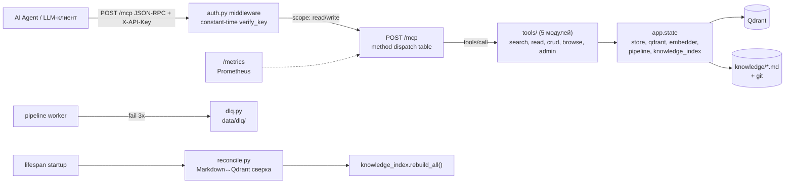
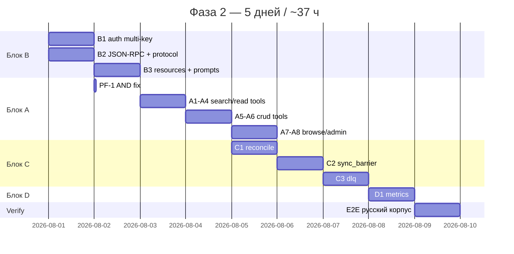

# 📊 ФАЗА 2: MCP-сервер, протокол и устойчивость

> **trace_id:** `code-2026-07-30-002` | **Автор:** analyst | **Дата:** 2026-07-31
> **Версия:** 1.0 | **Статус:** готов к реализации (post-Critic Gate, REVISE 0.58 → 6 фиксов применены → target ≥0.80)
> **Родительский план:** [`00-implementation-plan.md`](00-implementation-plan.md) **v3.1** §6 (расширение, НЕ замена)
> **Связанный борд:** [`.board.md`](../../.board.md:1) (cycle_iteration 2, critic_fixes_applied 6/6 ✅)
> **Зависимости:** Фаза 1 ✅ (готова) — [`store`](mcp_server/src/mcp_server/storage/markdown_store.py:1), [`qdrant`](mcp_server/src/mcp_server/storage/qdrant_client.py:1), [`embedder`](mcp_server/src/mcp_server/embedding/manager.py:1), [`pipeline`](mcp_server/src/mcp_server/indexing/pipeline.py:1), [`knowledge_index`](mcp_server/src/mcp_server/indexing/knowledge_index.py:1) доступны через `app.state`
>
> **История версий:**
> - **v1.0** (2026-07-31) — формализация борда Фазы 2: 4 блока (B→A→C→D), 15 задач, ~37 ч. 9 MCP Tools в 5 модулях, мульти-ключевая auth, ручной JSON-RPC, reconciliation, выделенные sync_barrier/dlq, Prometheus. Интегрированы 6 фиксов Critic Gate: P0-1 (AND-фикс `search_by_tags`), P1-1 (MCP protocol spec), P1-2 (three-way write flow), P1-3 (pagination контракт), P1-4 (migration path sync/dlq), P1-5 (constant-time auth).
>
> **Ключевой вопрос:** *как превратить готовое ядро Фазы 1 (store/qdrant/embedder/pipeline) в работающий MCP-продукт, которым могут пользоваться AI-агенты?*
> **Краткий ответ:** 4 блока поверх `app.state`: **B** (auth + JSON-RPC) → **A** (9 tools в 5 модулях) → **C** (reconciliation + выделенные sync/dlq) → **D** (Prometheus). Ручной JSON-RPC даёт контроль над протоколом; tools разделены по функциональным группам (не god-файл).

---

## 📑 Содержание

1. [Контекст и FPF-обоснование](#1-контекст-и-fpf-обоснование)
2. [Цель, приоритет, трудозатраты](#2-цель-приоритет-трудозатраты)
3. [Архитектура (поток данных) + файловая структура](#3-архитектура-поток-данных--файловая-структура)
4. [🔧 PRE-FLIGHT: P0-фикс унаследованного кода](#4-pre-flight-p0-фикс-унаследованного-кода)
5. [Задачи: Блок B — Auth + MCP-протокол](#5-задачи-блок-b--auth--mcp-протокол)
6. [Задачи: Блок A — 9 MCP Tools](#6-задачи-блок-a--9-mcp-tools)
7. [Задачи: Блок C — Устойчивость](#7-задачи-блок-c--устойчивость)
8. [Задачи: Блок D — Мониторинг](#8-задачи-блок-d--мониторинг)
9. [Контракты: JSON-RPC, auth, three-way write, pagination](#9-контракты-json-rpc-auth-three-way-write-pagination)
10. [Критерии приёмки (ACCEPTANCE)](#10-критерии-приёмки-acceptance)
11. [Метрики (EXPECTED)](#11-метрики-expected)
12. [Риски и mitigation](#12-риски-и-mitigation)
13. [Roadmap-слайс (5 дней)](#13-roadmap-слайс-5-дней)
14. [Интеграция с существующей архитектурой](#14-интеграция-с-существующей-архитектурой)

---

## 1. Контекст и FPF-обоснование

### 1.1 Постановка (C.30 — Grounded Architecture)

Фаза 1 ✅ построила **ядро**: SSOT+git, Qdrant, BGE-M3 in-process, chunker, async pipeline, INDEX.gen.yaml. Все компоненты доступны через `app.state` (см. [`main.py`](mcp_server/src/mcp_server/main.py:46)). Но сервер **не отвечает на запросы агентов**: нет MCP JSON-RPC эндпоинта, нет аутентификации, нет восстановления после сбоев (reconciliation), нет observability.

Применяем **C.30**: Фаза 2 — это **слой интерфейса и устойчивости** поверх готового ядра, а не новый движок.

**Существующие активы (из Фазы 1), которые делает Фазу 2 «дешёвой»:**

| Актив (Ф1) | Где | Что даёт бесплатно для Ф2 |
|------------|-----|---------------------------|
| `app.state.store` (MarkdownStore) | [`markdown_store.py`](mcp_server/src/mcp_server/storage/markdown_store.py:1) | CRUD read/write/update/delete + git-аудит → tools вызывают напрямую |
| `app.state.qdrant` (QdrantClient) | [`qdrant_client.py`](mcp_server/src/mcp_server/storage/qdrant_client.py:1) | `search()`, `search_by_tags()`, `scroll()` → tools переиспользуют |
| `app.state.embedder` (EmbeddingManager) | [`manager.py`](mcp_server/src/mcp_server/embedding/manager.py:1) | `embed_sync()` → `search_knowledge` embeds query через `run_in_executor` |
| `app.state.pipeline` (IndexingPipeline) | [`pipeline.py`](mcp_server/src/mcp_server/indexing/pipeline.py:1) | `enqueue(wait_for_index)` → write-flow ставит задачу + sync barrier |
| `app.state.knowledge_index` (KnowledgeIndex) | [`knowledge_index.py`](mcp_server/src/mcp_server/indexing/knowledge_index.py:143) | `get_map(domain?)` → `get_knowledge_map` tool читает из кэша (<5ms) |
| `app.state.chunker` (MarkdownChunker) | [`chunker.py`](mcp_server/src/mcp_server/indexing/chunker.py:1) | готовый чанкер для pipeline |

### 1.2 Архитектурные решения (D1–D4)

| # | Решение | Обоснование |
|---|---------|-------------|
| **D1** | **Ручной JSON-RPC** через FastAPI (не `fastmcp`) | Больше контроля над протоколом (initialize handshake, error codes, method dispatch). `fastmcp` абстрагирует детали, которые нужны для E2E и отладки |
| **D2** | **Tools разделены на 5 модулей** по функциональным группам | Не god-файл `tools.py` (300+ строк): `tools/search.py`, `tools/read.py`, `tools/crud.py`, `tools/browse.py`, `tools/admin.py`. OCP — новый tool = новый handler + регистрация |
| **D3** | **Порядок B → A → C → D** | B (auth+протокол) блокирующий для A (tools требуют routing+auth); C (reconciliation) зависит от A (проверяет то, что пишут tools); D (metrics) — над всем |
| **D4** | **MCP JSON-RPC эндпоинт `POST /mcp`** с method-based routing | Один эндпоинт, dispatch table `{"initialize": ..., "tools/list": ..., "tools/call": ...}` |

---

## 2. Цель, приоритет, трудозатраты

**Цель:** Реализовать полный MCP JSON-RPC интерфейс: **9 Tools** (в 5 модулях), **мульти-ключевую** аутентификацию (constant-time, graceful rotation), **reconciliation при старте** (+ удаление сирот), sync-флаг (CPU-aware), DLQ (выделенный модуль), структурную навигацию (`get_knowledge_map` + `search_by_tags`) и Prometheus-мониторинг. Всё — поверх готового ядра Фазы 1.

**Приоритет:** 🔴 HIGH (пользовательский контракт; превращает ядро в продукт)
**Трудозатраты:** **~37 ч** (≈ 5 дней); **P0-ядро = 28 ч** (минимальный viable: auth+JSON-RPC+9 tools+reconciliation — без выделенных sync/dlq рефакторинга и metrics)
**Решения (из [`00`](00-implementation-plan.md) §2):** #5, #6, #7 (sync), #9, #14, #18, #19, #30, #31

---

## 3. Архитектура (поток данных) + файловая структура



### 3.1 Новая файловая структура (над Фазой 1)

```
mcp_server/src/mcp_server/
├── auth.py              # 🆕 B1: middleware X-API-Key (constant-time)
├── main.py              # 🔧 B2: + POST /mcp JSON-RPC + wiring reconcile at startup
├── tools/               # 🆕 A1-A8: 9 MCP Tools (5 модулей)
│   ├── __init__.py      #    регистрация всех tools + schema registry
│   ├── search.py        #    search_knowledge + search_by_tags
│   ├── read.py          #    get_entry + get_knowledge_map
│   ├── crud.py          #    write_knowledge + update_entry + delete_entry
│   ├── browse.py        #    list_domains/subjects/projects (cursor pagination)
│   └── admin.py         #    reindex
├── resources.py         # 🆕 B3: kb:// tree (resources/list, resources/read)
├── prompts.py           # 🆕 B3: prompts/list, prompts/get
├── metrics.py           # 🆕 D1: /metrics Prometheus
├── indexing/
│   ├── reconcile.py     # 🆕 C1: сверка Markdown↔Qdrant + orphan delete
│   ├── sync_barrier.py  # 🆕 C2: sync-флаг (CPU-aware) — выделен из pipeline
│   └── dlq.py           # 🆕 C3: DLQ (выделен из pipeline) + replay
├── (Фаза 1 — без изменений)
```

---

## 4. 🔧 PRE-FLIGHT: P0-фикс унаследованного кода

> **Источник:** Critic Gate §6 P0-1 ([`.boardData.md`](../../.boardData.md:35)). Выполняется **ПЕРЕД блоком A**, блокирует task A2.

| # | Задача | Часы | Файл |
|---|--------|:---:|------|
| **PF-1** | **`search_by_tags` AND logic fix** | 0.1 | [`qdrant_client.py`](mcp_server/src/mcp_server/storage/qdrant_client.py:135) |

**Проблема:** `MatchAny(any=tags)` в `must` даёт **OR**-семантику (записи с любым из тегов). Для `match="all"` (AND) нужны N отдельных условий:

```python
# БЫЛО (OR — ломает match="all"):
must_conditions = [FieldCondition(key="tags", match=MatchAny(any=tags))]
# СТАЛО (AND — все теги обязаны присутствовать):
must_conditions = [FieldCondition(key="tags", match=MatchValue(value=tag)) for tag in tags]
```

Без фикса tool A2 `search_by_tags(match="all")` вернёт записи с любым тегом, а не со всеми — прямое нарушение acceptance criteria.

---

## 5. Задачи: Блок B — Auth + MCP-протокол (~6 ч)

> 🔴 **Блокирующий** для блока A (tools требуют auth + JSON-RPC routing).

| # | Задача (план №) | Часы | Файлы |
|---|-----------------|:---:|-------|
| **B1 (2.8)** | Мульти-ключевая аутентификация | 2 | [`auth.py`](mcp_server/src/mcp_server/auth.py) |
| **B2 (2.1)** | MCP JSON-RPC эндпоинт + protocol scaffold | 2 | [`main.py`](mcp_server/src/mcp_server/main.py:1) (дополнение) |
| **B3 (2.12)** | MCP Resources + Prompts | 2 | [`resources.py`](mcp_server/src/mcp_server/resources.py), [`prompts.py`](mcp_server/src/mcp_server/prompts.py) |

### B1: Мульти-ключевая аутентификация (#6, #18)

`MCP_READ_KEYS[]` / `MCP_WRITE_KEYS[]` из `.env` (через [`config.py`](mcp_server/src/mcp_server/config.py:19)). FastAPI middleware: header `X-API-Key`.

- **Read-ключ** → только search/get/list/map (read-tools).
- **Write-ключ** → все tools (read + write: write/update/delete/reindex).
- **Graceful rotation:** добавить новый в список → перезапуск → перевести клиентов → убрать старый → перезапуск.

> ⛔ **P1-5 (constant-time):** сравнение ключей — **`hmac.compare_digest(provided_key, stored_key)`**. Прямое `==` уязвимо к timing attacks (побайтовое угадывание ключа по времени ответа). Обход всех ключей списка с `hmac.compare_digest`, первый совпавший — доступ. Маскирование в логах (только хеш).

### B2: MCP JSON-RPC эндпоинт + protocol scaffold (#5, P1-1)

`POST /mcp` — JSON-RPC 2.0. Method-based routing через dispatch table.

**MCP Protocol Spec (P1-1):**

| Компонент | Детали |
|-----------|--------|
| **Protocol version** | `2024-11-05` (пиннинг в `SERVER_PROTOCOL_VERSION`) |
| **`initialize`** | Handshake: клиент → `{"method":"initialize","params":{"protocolVersion":"...","clientInfo":{...}}}` → сервер: `{"protocolVersion":"2024-11-05","serverInfo":{...},"capabilities":{"tools":{},"resources":{},"prompts":{}}}` |
| **`tools/list`** | Возврат всех 9 tools с JSON Schema (`inputSchema` + `outputSchema`): `{"type":"object","properties":{...},"required":[...]}` |
| **`tools/call`** | `{"method":"tools/call","params":{"name":"search_knowledge","arguments":{...}}}` → валидация через JSON Schema → вызов handler |
| **`resources/list`, `resources/read`** | `kb://` tree: `kb://{domain}` → subjects; `kb://{domain}/{subject}` → knowledge_ids |
| **`prompts/list`, `prompts/get`** | «как структурировать знание», «best-practice для write_knowledge» |
| **Error codes** | −32700 parse error, −32600 invalid request, −32601 method not found, −32602 invalid params, −32000..−32099 MCP-specific (tool not found, auth failed, rate limit) |
| **Request limit** | Body ≤ 1 MB (DoS protection) |
| **Batch (P2)** | Массив запросов → массив ответов; может быть deferred |

### B3: MCP Resources + Prompts (#5)

- **Resources:** `kb://{domain}` → список subject; `kb://{domain}/{subject}` → список knowledge_id (агрегация через `app.state.qdrant.scroll()`).
- **Prompts:** «как структурировать знание», «best-practice для write_knowledge».

---

## 6. Задачи: Блок A — 9 MCP Tools (~16 ч)

| # | Tool (план №) | Модуль | Часы | Права |
|---|---------------|--------|:---:|:---:|
| **A1 (2.2)** | `search_knowledge` | [`tools/search.py`](mcp_server/src/mcp_server/tools/search.py) | 3 | read |
| **A2 (2.15)** | `search_by_tags` | [`tools/search.py`](mcp_server/src/mcp_server/tools/search.py) | 2 | read |
| **A3 (2.3)** | `get_entry` | [`tools/read.py`](mcp_server/src/mcp_server/tools/read.py) | 1 | read |
| **A4 (2.14)** | `get_knowledge_map` | [`tools/read.py`](mcp_server/src/mcp_server/tools/read.py) | 2 | read |
| **A5 (2.4)** | `write_knowledge` | [`tools/crud.py`](mcp_server/src/mcp_server/tools/crud.py) | 3 | write |
| **A6 (2.5)** | `update_entry` / `delete_entry` | [`tools/crud.py`](mcp_server/src/mcp_server/tools/crud.py) | 2 | write |
| **A7 (2.6)** | `list_domains/subjects/projects` | [`tools/browse.py`](mcp_server/src/mcp_server/tools/browse.py) | 2 | read |
| **A8 (2.7)** | `reindex` | [`tools/admin.py`](mcp_server/src/mcp_server/tools/admin.py) | 1 | write |

### A1: `search_knowledge`

Query → embed (in-process, через `loop.run_in_executor`) → `app.state.qdrant.search()` с filters (domain, subject, project, tags), top_k=5, score_threshold. Возврат `SearchResult[]`.

### A2: `search_by_tags` (после PF-1)

Exhaustive поиск через Qdrant payload filter по `tags[]`. `match="all"` → AND, `match="any"` → OR. `limit` (default 500, hard max 1000). `truncated:true` + `total_count` при переполнении. **Без GPU** (p95 < 50 ms).

### A4: `get_knowledge_map`

`get_knowledge_map(domain?)` → root или per-section INDEX.gen.yaml. Чтение из in-memory cache (`app.state.knowledge_index.get_map()`, <5ms). Read-after-write: после write индекс уже обновлён (Ф1 гарантирует `update_section`).

### A5: `write_knowledge` + Three-way write flow (P1-2)

`write_knowledge(content, domain, subject, ..., wait_for_index=false)`. Write-операция выполняет **ТРИ шага** последовательно:

```
1. store.write(entry)                       → Markdown SSOT (.md + git commit)
2. pipeline.enqueue(entry, wait_for_index)  → chunk → embed → Qdrant upsert
3. knowledge_index.update_section(domain)   → инкрементальный INDEX.gen.yaml
```

**Контракт consistency:**
- **Steps 1-2:** атомарность через pipeline (store.write успешен → enqueue гарантирован).
- **Step 3:** best-effort (ошибка INDEX gen не откатывает SSOT — лог WARN + метрика `index_gen_errors_total`).
- **`wait_for_index=true`:** sync barrier ждёт завершения шага 2 (таймаут 30с), затем шаг 3 → read-after-write consistency (`get_knowledge_map` видит новую запись).
- **`wait_for_index=false`:** шаги 2-3 асинхронно, `pending:true` в ответе.

> 📎 Acceptance: «write → `get_knowledge_map` → запись видна» ([`.boardData.md`](../../.boardData.md:76) P1-2).

### A7: `list_*` + Cursor pagination (P1-3)

Агрегация уникальных domain/subject/project через Qdrant `scroll()`.

**Pagination контракт:**
```json
// Request:  {"cursor": null, "limit": 100}
// Response: {"results": ["domain-a", ...], "next_cursor": "abc123", "total_count": 574}
```
- **Cursor-based:** `next_cursor` = Qdrant `scroll()` offset. Stateless (клиент передаёт обратно).
- **Limit:** default 100, hard max 1000 (защита от сверхбольших запросов).
- **Termination:** `next_cursor=null` → последняя страница.
- **Фильтрация:** `domain`/`subject` опциональны (сужают выборку через Qdrant filter).

---

## 7. Задачи: Блок C — Устойчивость (~10 ч)

| # | Задача (план №) | Часы | Файлы |
|---|-----------------|:---:|-------|
| **C1 (2.9)** | Reconciliation при старте | 4 | [`indexing/reconcile.py`](mcp_server/src/mcp_server/indexing/reconcile.py) |
| **C2 (2.10)** | Sync-флаг барьер (CPU-aware) | 3 | [`indexing/sync_barrier.py`](mcp_server/src/mcp_server/indexing/sync_barrier.py) |
| **C3 (2.11)** | Dead Letter Queue (выделенный) | 3 | [`indexing/dlq.py`](mcp_server/src/mcp_server/indexing/dlq.py) |

### C1: Reconciliation при старте (#19)

В `lifespan` startup: обход `knowledge/**/*.md` → сравнение `updated_at` из frontmatter с payload Qdrant. Расхождения (новее в Markdown / отсутствует в Qdrant) → доиндексация. **Обратная сверка (v2.2):** Qdrant-точки без `.md` (сироты от ручного удаления) → **delete**. Лог: `{checked, reindexed, skipped, deleted_orphans}`. После сверки → `knowledge_index.rebuild_all()`.

> ⚠️ **P2-2 (Qdrant-down):** при недоступности Qdrant на старте — retry (3×, backoff) → WARN + продолжить в read-degraded (search вернёт ошибку, но сервер стартует).

### C2: Sync-флаг барьер (CPU-aware) (#9, P1-4)

Выделить sync-барьер из [`pipeline.py`](mcp_server/src/mcp_server/indexing/pipeline.py:56) в отдельный модуль. CPU-aware: при `backend=cpu` и >20 чанков → сразу `pending:true` + приоритет в очереди.

**Migration path (P1-4):**
```
1. Создать sync_barrier.py — перенести _sync_events, SyncEvent, wait_for_index логику
2. Обновить pipeline.py: импортировать из sync_barrier, удалить старый код
3. Сохранить интерфейс: pipeline.enqueue(..., wait_for_index=True) → sync_barrier.wait(knowledge_id, timeout=30)
4. Smoke test: write → wait_for_index=true → verify Qdrant point exists
```

### C3: Dead Letter Queue (выделенный) (#14, P1-4)

Выделить DLQ-логику из [`pipeline.py:292`](mcp_server/src/mcp_server/indexing/pipeline.py:292) в отдельный модуль. Retry с backoff (1с, 4с, 16с) ×3 → `data/dlq/`. Алерт при `dlq_size > 10`.

**Migration path (P1-4):**
```
1. Создать dlq.py — перенести _handle_batch_failure, retry с backoff, запись в /app/data/dlq/
2. Обновить pipeline.py: импортировать из dlq, удалить старый код
3. Совместимость с cli.py: make dlq-replay → cli.dlq_replay() → dlq.replay_all()
4. Smoke test: сломать Qdrant → batch fail → DLQ запись → replay → verify
```

---

## 8. Задачи: Блок D — Мониторинг (~5 ч)

| # | Задача (план №) | Часы | Файлы |
|---|-----------------|:---:|-------|
| **D1 (2.13)** | Prometheus-метрики | 5 | [`metrics.py`](mcp_server/src/mcp_server/metrics.py) |

**`/metrics` эндпоинт.** Метрики: `queue_size`, `dlq_size`, `search_latency` (p50/p95/p99 — гистограмма), `embed_backend` (gauge: gpu/cpu), `collection_size`, `reconcile_checked/reindexed/skipped/deleted_orphans`, `index_gen_latency`, `knowledge_map_latency`, `tag_search_latency`, `mcp_requests_total{method}`, `index_gen_errors_total`.

---

## 9. Контракты: JSON-RPC, auth, three-way write, pagination

### 9.1 JSON-RPC envelope

```json
// Request
{"jsonrpc": "2.0", "id": 1, "method": "tools/call",
 "params": {"name": "search_knowledge",
            "arguments": {"query": "асинхронные паттерны", "domain": "engineering"}}}
// Response (success)
{"jsonrpc": "2.0", "id": 1, "result": {...}}
// Response (error)
{"jsonrpc": "2.0", "id": 1, "error": {"code": -32601, "message": "method not found"}}
```

### 9.2 Auth scope matrix

| Tool | Read-key | Write-key |
|------|:--------:|:---------:|
| search/get/list/map/tags | ✅ | ✅ |
| write/update/delete/reindex | ❌ 403 | ✅ |

> ⛔ **stdio = локальный доверенный режим без auth** ([`00`](00-implementation-plan.md) §1.1). HTTP (`:8000`) — обязательная проверка мульти-ключей.

### 9.3 Three-way write (см. §6 A5) · 9.4 Pagination (см. §6 A7)

---

## 10. Критерии приёмки (ACCEPTANCE)

### Протокол + auth (B)
- ✅ `POST /mcp` с `{"method":"initialize"}` → handshake с `protocolVersion:"2024-11-05"` + `capabilities`
- ✅ `tools/list` возвращает все 9 tools с валидной JSON Schema (`inputSchema`)
- ✅ read-key отклоняет `write_knowledge` с `403`; **второй read-key** в списке также работает (мульти)
- ✅ **constant-time auth:** `hmac.compare_digest` используется (grep: нет прямого `==` для ключей)
- ✅ Запрос > 1 MB → `−32600 invalid request`

### 9 Tools (A)
- ✅ `search_knowledge("асинхронные паттерны python", domain="engineering")` → релевантные чанки со score (**русский корпус**, #10)
- ✅ `search_by_tags(["docker","best-practice"], match="all")` → **все** записи с ОБА тегами (после PF-1); `match="any"` → OR
- ✅ `search_by_tags` при >500 совпадениях → `truncated:true` + `total_count` + WARN
- ✅ `get_knowledge_map()` → root INDEX (<5ms); `get_knowledge_map(domain="engineering")` → per-section
- ✅ **read-after-write:** `write_knowledge` → `get_knowledge_map(domain=...)` → новая запись **видна** без задержки
- ✅ `write_knowledge(..., wait_for_index=true)` на GPU → `indexed:true` (≤5с); на CPU (>20 чанков) → `pending:true`
- ✅ `list_domains` с cursor pagination: `next_cursor` работает, `limit` enforced, `total_count` корректен

### Устойчивость (C)
- ✅ **Reconciliation:** рестарт при «потерянной» задаче (Markdown записан, Qdrant нет) → при старте доиндексируется, поиск находит запись
- ✅ **Orphan delete:** Qdrant-точки без `.md` → `delete`, лог содержит `deleted_orphans`
- ✅ **DLQ:** embed error → 3 retry → задача в `data/dlq/` + алерт при `dlq_size>10`; `make dlq-replay` возвращает в очередь
- ✅ **Refactor safe:** после выделения sync_barrier/dlq — worker loop работает, smoke-тест проходит

### Мониторинг (D)
- ✅ `/metrics` отдаёт Prometheus-формат (`queue_size`, `dlq_size`, `search_latency`, `embed_backend`, ...)
- ✅ **1 uvicorn worker** (`WORKERS=1`) — инвариант задокументирован

---

## 11. Метрики (EXPECTED)

| Метрика | Целевое значение |
|---------|------------------|
| Latency `search_knowledge` (p95) | < 150 ms (без embed) / < 300 ms (с embed) |
| Latency `get_entry` (p95) | < 30 ms |
| Latency `get_knowledge_map` (p95) | < 5 ms (in-memory cache) |
| Latency `search_by_tags` (p95) | < 50 ms (payload filter, без GPU) |
| Sync-флаг (GPU, p99) | ≤ 5 сек |
| Sync-флаг на CPU (>20 чанков) | `pending:true` (≤5 сек возврат) |
| Reconciliation (10K, сверка) | < 5 мин (без доиндексации) |
| DLQ при healthy-системе | 0 задач |
| Покрытие тестами MCP Tools | ≥ 90% |

---

## 12. Риски и mitigation

| Риск | Вер-ть | Sev. | Mitigation |
|------|:------:|:----:|------------|
| Sync-флаг висит >30 сек | Средняя | 🟠 | CPU: `pending:true` сразу для >20 чанков; жёсткий таймаут 30с |
| In-memory очередь теряется при рестарте | Высокая | 🔴 | **Reconciliation C1** при старте (#19) |
| API-key утёк / timing attack | Низкая | 🔴 | `hmac.compare_digest` (P1-5); маскирование в логах (только хеш) |
| DLQ переполняется при отказе embed | Средняя | 🟠 | Алерт при `dlq_size>10`; метрика в Prometheus |
| Рефакторинг pipeline ломает worker | Низкая | 🟠 | Migration path (P1-4): extract→import→smoke test; сохранение интерфейсов |
| Reconciliation на CPU при 10K diverged долго | Средняя | 🟡 | Сверка (без embed) <5 мин; доиндексация — фон. Qdrant-down retry (P2-2) |
| Конкурентная запись в `knowledge_id` | Низкая | 🟡 | Last-write-wins + WARN (optimistic locking — Ф3, задача 3.10) |

---

## 13. Roadmap-слайс (5 дней)

> При 1 backend-разработчике (8 ч/д). Зависит от Ф1 ✅. Идёт **после M1**.



### Вехи

| Веха | День | Критерий |
|------|:----:|----------|
| **M2a: Auth + Protocol** | 1 | B1-B3: `POST /mcp` handshake + multi-key auth + resources/prompts |
| **M2b: 9 Tools** | 3 | A1-A8: все tools отвечают по JSON-RPC; PF-1 AND fix; read-after-write consistency |
| **M2: MCP MVP** | 5 | + C1-C3 (reconcile/sync/dlq) + D1 (metrics); E2E на русском (#10); ≥90% покрытие |

---

## 14. Интеграция с существующей архитектурой

| Компонент | Изменение | Совместимость |
|-----------|-----------|---------------|
| `main.py` (Ф1) | + `POST /mcp` router + auth middleware + reconcile в `lifespan` | ✅ аддитивно; health router сохранён |
| `app.state.*` (Ф1) | Tools читают store/qdrant/embedder/pipeline/knowledge_index | ✅ без изменений Ф1 |
| [`pipeline.py`](mcp_server/src/mcp_server/indexing/pipeline.py:1) | sync/dlq выделены в модули (C2/C3) | ✅ интерфейс сохранён (migration path) |
| [`knowledge_index.py`](mcp_server/src/mcp_server/indexing/knowledge_index.py:143) | `get_map()` используется tool A4 | ✅ reuse (Ф1 готов) |
| [`cli.py`](mcp_server/src/mcp_server/cli.py:54) | `dlq-replay` → `dlq.replay_all()` (C3) | ✅ совместимость с Makefile |
| [`config.py`](mcp_server/src/mcp_server/config.py:19) | `MCP_*_KEYS` уже описаны | ✅ без изменений |

---

> **FPF-методология:** C.30 (Grounded Architecture — Фаза 2 = слой интерфейса/устойчивости поверх готового ядра Ф1 через `app.state`), A.22 (Structure Views — декомпозиция на 4 блока B→A→C→D + 5 tool-модулей), A.10 (Evidence Graph — 6 фиксов Critic Gate P0-1/P1-1..5 интегрированы). Бюджет ~37 ч; P0-ядро 28 ч даёт рабочий MCP-сервер даже без metrics/refactoring.
